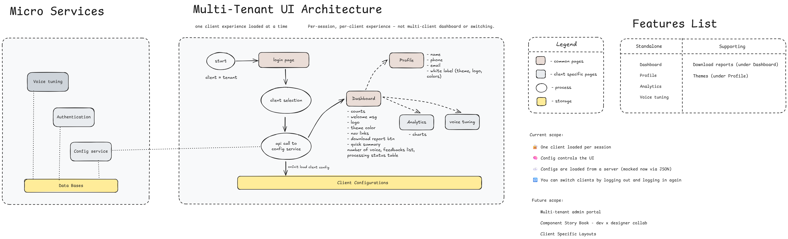

# 🧩 Multi-Tenant Angular UI – Config-Driven Architecture with NgRx

This is a proof-of-concept (POC) project to demonstrate how to build a scalable, maintainable multi-tenant UI in Angular. The application is fully config-driven — meaning all branding, feature flags, routing access, and even form fields are dynamically loaded based on the client (tenant) selected during login.

---

## ⚙️ Tech Stack

- **Angular** with standalone components
- **NgRx** for state management
- **RxJS** for reactive data streams
- **Config-driven routing**
- **Guards** for feature-level access control
- **Minimal CSS** inspired by Uber-style black & white design
---

## 🧠 Key Features

- ✅ Dynamic theming (logo, color) per client
- ✅ Feature toggles per client via config JSON
- ✅ Profile fields rendered dynamically
- ✅ Route guards to restrict feature access
- ✅ Navigation bar driven by enabled features
- ✅ Logout resets session and store
- ✅ Clean folder structure and scalable architecture
- ✅ README + Architecture Diagrams + Performance Notes

---

## 🧭 Architecture Diagram



---

## 🔁 Flow Overview

1. **Login page** → Choose client ID
2. **NgRx action** dispatched → `loadClientConfig`
3. **Effect** makes API call to `/assets/client-config.json`
4. **Reducer** saves config to store
5. **Components** subscribe to config via selectors
6. **UI updates dynamically** — navbar, routes, features, styling
7. **Guards** restrict access to unavailable features

---

## Assignment Details


---

## 📂 Folder Structure
<pre lang="markdown"> ```plaintext src/app/ │ ├── store/ # NgRx actions, reducer, selectors, effects ├── guards/ # Route guards based on config ├── login/ # LoginComponent (client selector) ├── dashboard/ # DashboardComponent with nav ├── profile/ # ProfileComponent with dynamic fields ├── analytics/ # Stubbed feature page ├── not-available/ # Fallback route component │ ├── routes.ts # All route configs └── main.ts # App bootstrap with store + router ``` </pre>
---

## ➕ Adding a New Client
1. Add a new object under assets/client-config.json
2. Include:
   - themeColor, logo
   - features → standAlone + supporting
   - profileFields
3. No code changes required — the app adapts automatically!

## 🔐 Route Guards
Each feature page is protected via a corresponding guard. If a feature is disabled for a client, they will be redirected to /not-available.
Example:
canActivate: [analyticsGuard]

## 🚀 Running Locally
- npm install
- ng serve
- Then navigate to:
📍 http://localhost:4200/login

## 🧠 Key Takeaways
- Config-first architecture drastically simplifies multi-client maintenance
- NgRx gives clear separation of concerns for data and state
- Guards allow clean enforcement of feature availability
- Scalable UI foundation for SaaS platforms or white-labeled dashboards

## 🙏 Shoutout
Special thanks to the team at Pradhi.ai for designing an assignment that was both challenging and insightful. It helped stretch my skills around architectural thinking, Angular DX, and dynamic UI flows.

## 📬 Let’s Talk
If you’re curious about the architecture, tradeoffs, or want a walkthrough —
I’d love to talk!
→ [[Your LinkedIn]](https://www.linkedin.com/in/koushik-busim-13716092/)
→ [Your Email](busimnk@gmail.com)
